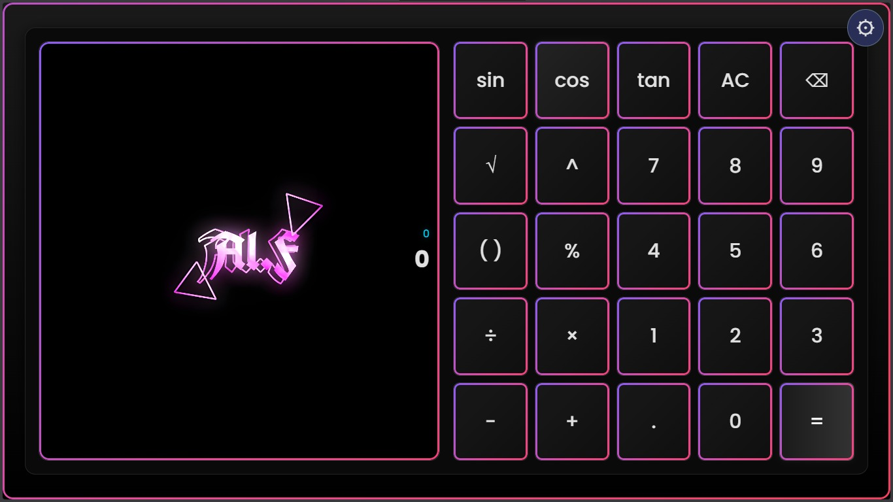

# ModernCalcShader - Kalkulator WebView 100% SRGB



## Deskripsi
Remake ModernCalc dengan fokus ke konversi RGB ke HEX dan sebaliknya. Ada preview warna real time. Cocok buat web dev dan UI designer. Dibuat oleh Alff Senpai & Saka.dlv.

## Fitur Utama  
• Preview warna real time  
• Validasi input.  
• Kontrol keyboard full  
• Tema Light dan Dark  
• Desain responsif desktop dan mobile  
• Animasi ringan. Gak berat  
• UI clean. 

## Cara Pakai

Clone repo  
```
git clone https://github.com/Alfareza26/ModernCalcShader.git
```
```
cd moderncalc
```  
Buka index.html di browser  

## Kontrol Keyboard
• Angka 0 sampai 9 untuk input  
• Tab pindah field  
• Enter fokus ke copy HEX  
• Backspace hapus nilai  

## Teknologi
• HTML5  
• CSS3 dengan variabel warna  
• JavaScript ES6  
• Google Fonts untuk UI clean  

## Kontributor
• Alff Senpai. Logic dan core feature  
• Saka.dlv. UI dan visual  
 
• v1.1. Copy button. UI refine
